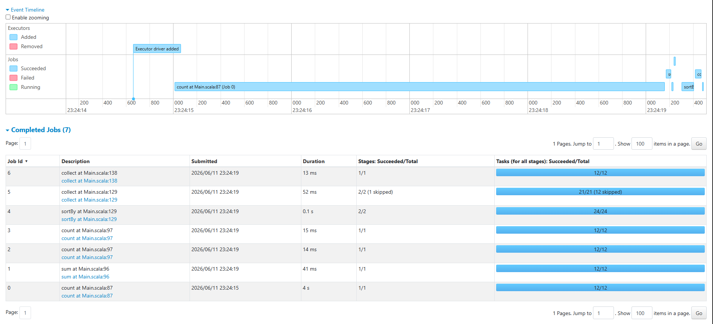
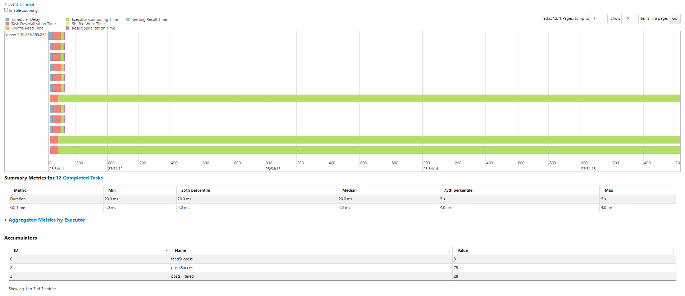
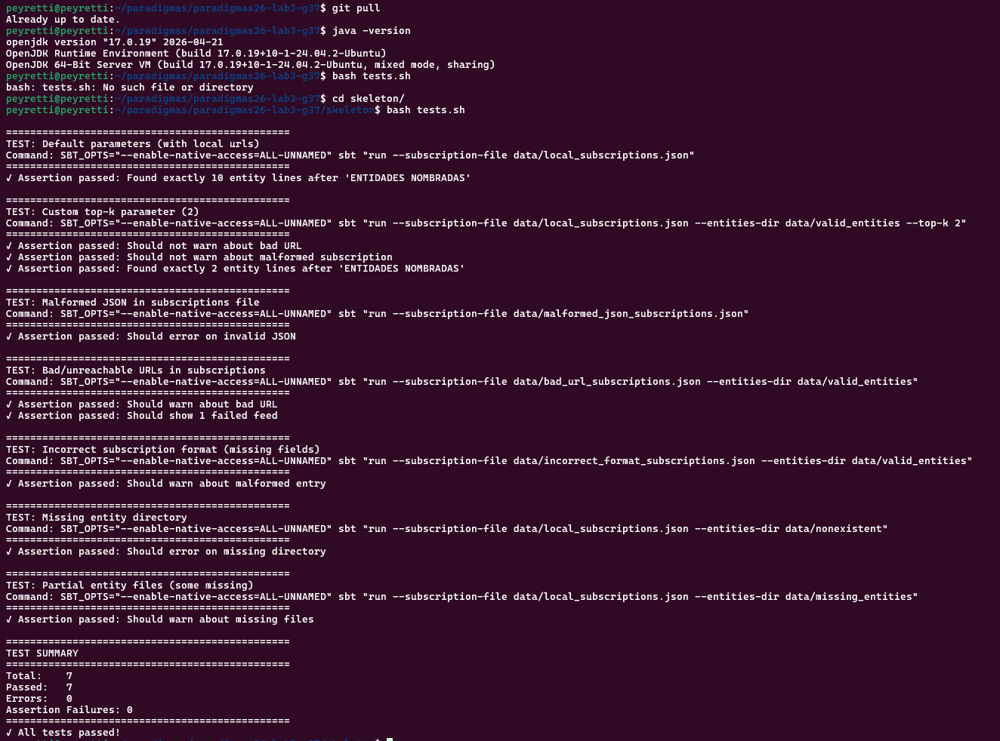

# Ejercicio 1

## A

## Diagrama

Conexión → Descarga → Extracción → Clasificación → Conteo → Ranking

Subscriptions
List[Subscription] — Subscription(name: String, url: String)
        |
    List[Subscription]
        |   
        ↓
Connection / Download
downloadFeed(url: String): Option[String]
        |
    Option[String] (raw JSON)
        |
        ↓
Parse JSON → Posts
parsePosts(json: String, name: String): List[Post]
        |
    List[Post]
        |
        ↓
      Filter
filterEmptyPosts(posts: List[Post]): List[Post]
        |
    List[Post] (filtrados)
        |
        ↓
Entity Extraction
detectEntities(text: String, dictionary: List[NamedEntity]):
List[NamedEntity]
        |
    List[NamedEntity]
        |
        ↓
Classification
NamedEntity.entityType: String (Person, Organization, ...)
        |
    List[NamedEntity] -> Map[(String,String),Int]
        |
        ↓
     Conteo
countEntities(entities: List[NamedEntity]):
Map[(String,String),Int]
        |
    Map -> List(sorted)
        |
        ↓
     Ranking
Sorted List[((String,String),Int)] — top-k

## Conexiones y tipos (Scala):

subscriptions: List[Subscription]
Subscription(name: String, url: String)
downloadFeed(url: String): Option[String]
parsePosts(json: String, name: String): List[Post]
Post(title: String, selftext: String)
filterEmptyPosts(posts: List[Post]): List[Post]
detectEntities(text: String, dictionary: List[NamedEntity]): List[NamedEntity]
countEntities(entities: List[NamedEntity]): Map[(String,String),Int]

## B

Leer suscripciones
No es parte del pipeline de transformación de datos de Spark: es lectura de
configuración/preprocesamiento.

Descargar feeds
map: cada suscripción produce exactamente un resultado (JSON o None). Si se descarta None,
sigue siendo un paso de tipo map + filter.

Parsear JSON en posts
flatMap: cada feed puede producir cero o más posts; JSON vacío o mal formado produce 0
posts.

Filtrar posts vacíos
map/filter: transforma la colección de posts manteniendo solo los válidos; pudiera verse
como un map que devuelve 0 o 1 elemento por post, pero en Spark normalmente se hace
filter.

Detectar entidades
flatMap: un post puede generar múltiples entidades, o ninguna; cada entrada produce cero o
más salidas.

Clasificar entidades
map: cada entidad se etiqueta con su tipo y no cambia el número de elementos.

Contar entidades
reduceByKey: agrupa por (tipo, nombre) y suma los conteos; es una reducción por clave.

Ranking
No encaja exactamente en map/filter/reduceByKey. Es una operación de ordenamiento y
selección global posterior a la agregación.

## cuales no encajan
no encajan leer suscripciones y ranking, ya que leer suscripciones no es una transformación de datos dentro del
pipeline de Spark y ranking es una operación de ordenamiento y selección posterior a la agregación.

## C

## Pasos independientes entre workers

Descargar feeds, parsear JSON, filtrar posts, detectar entidades y clasificar entidades
son independientes: cada worker procesa sus elementos sin necesitar los resultados de los
demás.

## Pasos barrera 

La etapa de contar entidades (reduceByKey) es una barrera de sincronización porque los
resultados parciales de todos los workers deben combinarse. Además, el ranking/top-k
también es global, ya que necesita ver la colección agregada completa antes de seleccionar
los mejores.

## D

Spark impone que las funciones sean serializables, sin estado compartido mutable, y con pocos o
ningún efectos secundarios, mientras esto se respete, los workers funcionaran.

# Ejercicio 2

Si dejamos que la excepción se propague desde dentro de un flatMap el fallo puede detener el procesamiento de todo el job en vez de sólo esa entrada

# ejercicio 3

- reduceByKey es una barrera de sincronización. ¿Qué ocurre en el cluster en ese punto? ¿Por qué es inevitable para este problema?
Cuando se invoca un reduceByKey, el clúster ejecuta una serie de pasos coreografiados que dividen el plan de ejecución en dos etapas, en la frontera entre estas dos etapas se encuentra la barrera de sincronización. Y es inevitable debido a la necesidad de pasar de un estado local a uno global

- ¿Qué restricciones debe cumplir la función que se le pasa a reduceByKey? Piensen en conmutatividad y asociatividad.
debe cumplir asociatividad y conmutatividad ya que si la función no cumple con ambas, el resultado del cómputo distribuido será incorrecto o no determinístico

# ejercicio 4 

- El valor de los Accumulators puede ser actualizado durante una tarea, al haber la posibilidad de multiples tareas, no se puede garantizar que el driver haya recibido las actualizaciones al momento de consultar los valores.

- El valor de un Accumulator solo esta disponible para el driver de forma consistente tras ejecutar una accion terminal como .count() o .collect() que fuerza la evaluacion.

- Aunque se esta trabajando sobre una cantidad pequeña de datos, las medidas observadas tienen una diferencia significativa, estos son los valores reportados por Peyretti Marco:

> ~19.271 s sin uso de Spark

> ~6.83 s paralelizando con Spark

> cabe la mencion, la maquina cuenta con DRR5

como se puede ver, la diferencia es notable incluso con un set de datos tan pequeño, por lo cual paralelizar el proceso implica una mejora substancial.

> 
> 
# ejercicio 5

- Sin una llamada a cache(), se deberia recomputar el RDD cada vez que es necesario. En nuestro caso los feeds se descargaria 3 veces, primero para verificar si hay posts, segundo para el conteo de entidades y tercero para el calculo de estadisticas por tipo.

- collect() trae los datos presentes en RDD al driver, lo cual implica la perdida de paralelismo ya que no son accesibles para los workers.

- cache() solo marca al RDD para su persistencia, el almacenamiento real ocurre cuando se ejecuta una accion terminal sobre ese RDD

# SOBRE LOS TESTS

> 

probado en maquina de Peyretti Marco